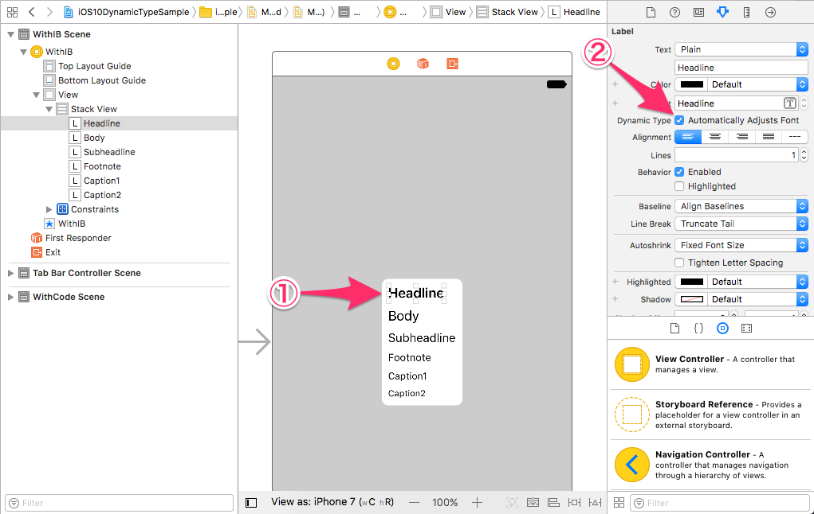

# iOS10DynamicTypeSample
iOS10 Dynamic Type Sample

## development environment
- macOS Sierra Version 10.12.3
- Xcode Version 8.3
- iPhone 6s, iOS 10.3

## Screenshot


## Implementation
### With Interface Builder (Xcode 8.3 +)


### With Code
```swift
class ViewController: UIViewController {
    @IBOutlet weak var headlineLabel: UILabel!
    
    // ...

    override func viewDidLoad() {
        super.viewDidLoad()
        
        // [1] 
        self.headlineLabel.font = UIFont.preferredFont(forTextStyle: .headline)
        
        // ...
        
        // [2] 
        self.headlineLabel.adjustsFontForContentSizeCategory = true
        
        // ...
    }
}
```

## Reference
- [What's New in Cocoa Touch - WWDC 2016 - Videos - Apple Developer](https://developer.apple.com/videos/play/wwdc2016/205/)
